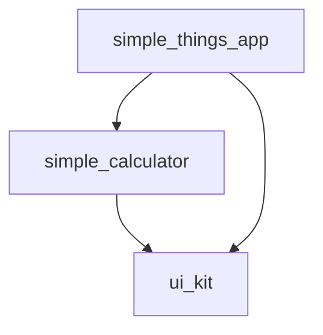

# Flutter Melos Monorepo

## English

### Project Description
This repository is a Flutter monorepo built with Melos.  
It demonstrates a clean modular architecture with reusable UI components, feature-based packages, and automated CI/versioning flows.

### Architecture Goals
- Clean modular structure
- Feature-based package separation
- Automatic versioning with Melos
- GitHub Actions CI
- Automatic changelog generation
- Dev and Master branch release flow

### Architecture Overview
- `packages/ui_kit`: shared UI primitives and design constants.
- `packages/simple_calculator`: calculator feature package (screen, input widget, logic).
- `apps/simple_things_app`: runnable application that composes feature packages.
- Dependency direction is one-way:
  - `simple_calculator -> ui_kit`
  - `simple_things_app -> simple_calculator + ui_kit`

### Folder Structure
```text
.
├── .github/
│   └── workflows/
│       ├── pr_check.yml
│       ├── dev_version.yml
│       └── release_version.yml
├── apps/
│   └── simple_things_app/
├── packages/
│   ├── ui_kit/
│   └── simple_calculator/
├── CHANGELOG.md
├── pubspec.yaml
└── README.md
```

### Melos Graph
Generate dependency graph:

```bash
fvm dart run melos list --graph
```

Current package dependency graph:



### Bootstrap Project
```bash
fvm use
fvm flutter pub get
fvm dart run melos bs
```

### Run the App
```bash
cd apps/simple_things_app
fvm flutter run
```

### Versioning with Melos
Melos versioning is based on Conventional Commits and updates changelog automatically.

- Dev pre-release flow:
```bash
fvm dart run melos version -p --preid dev --yes
```
- Master release graduation:
```bash
fvm dart run melos version -g --yes
```

Generated artifacts:
- root workspace changelog (`CHANGELOG.md`)
- package versions and tags
- package changelog updates (when applicable)

### Release Flow (develop -> master)
1. Create feature branch from `develop` (`feature/<name>`).
2. Open PR into `develop` and pass checks.
3. After merge to `develop`, CI creates pre-release versions (`-dev`).
4. After collecting changes, merge `develop` into `master` (often squash merge).
5. Push to `master` runs graduate versioning (`-g`) and creates stable tags.

### GitHub Actions CI
- `pr_check.yml` (on `pull_request`):
  - install dependencies
  - format
  - analyze
  - test
- `dev_version.yml` (on push to `develop`):
  - `verify` job (format/analyze/test)
  - `version` job (pre-release versioning + tags)
- `release_version.yml` (on push to `master`):
  - `verify` job (format/analyze/test)
  - `version` job (graduate release + tags)

### Conventional Commit Examples
```text
feat(calculator): add percent and sign toggle keys
fix(calculator): handle pending minus token
chore: split verify and version jobs
docs(readme): readme updated
```

---

## Русский

### Описание проекта
Это Flutter monorepo на Melos.  
Проект демонстрирует чистую модульную архитектуру, переиспользуемый UI kit и автоматизированные процессы CI/версионирования.

### Цели архитектуры
- Чистая модульная структура
- Разделение по feature-пакетам
- Автоматическое версионирование через Melos
- CI на GitHub Actions
- Автоматическая генерация changelog
- Релизный flow через ветки Dev и Master

### Обзор архитектуры
- `packages/ui_kit`: общие UI-компоненты и дизайн-константы.
- `packages/simple_calculator`: feature-пакет калькулятора (экран, клавиатура, логика).
- `apps/simple_things_app`: запускаемое приложение, собирающее фичи.
- Зависимости направлены в одну сторону:
  - `simple_calculator -> ui_kit`
  - `simple_things_app -> simple_calculator + ui_kit`

### Структура проекта
```text
.
├── .github/
│   └── workflows/
│       ├── pr_check.yml
│       ├── dev_version.yml
│       └── release_version.yml
├── apps/
│   └── simple_things_app/
├── packages/
│   ├── ui_kit/
│   └── simple_calculator/
├── CHANGELOG.md
├── pubspec.yaml
└── README.md
```

### Melos Graph
Сгенерировать граф зависимостей:

```bash
fvm dart run melos list --graph
```

Текущий граф зависимостей пакетов:


### Bootstrap проекта
```bash
fvm use
fvm flutter pub get
fvm dart run melos bs
```

### Запуск приложения
```bash
cd apps/simple_things_app
fvm flutter run
```

### Как работает версионирование
Melos использует Conventional Commits и автоматически обновляет changelog.

- Dev pre-release:
```bash
fvm dart run melos version -p --preid dev --yes
```
- Master graduate release:
```bash
fvm dart run melos version -g --yes
```

Что обновляется:
- workspace changelog в корне (`CHANGELOG.md`)
- версии пакетов и теги
- changelog пакетов (где применимо)

### Release flow (develop -> master)
1. Создание feature-ветки от `develop` (`feature/<name>`).
2. PR в `develop` с прохождением проверок.
3. После merge в `develop` CI делает prerelease версии (`-dev`).
4. После набора изменений `develop` вливается в `master` (часто squash merge).
5. Push в `master` запускает graduate (`-g`) и создает стабильные теги.

### CI в GitHub Actions
- `pr_check.yml` (событие `pull_request`):
  - установка зависимостей
  - форматирование
  - анализ
  - тесты
- `dev_version.yml` (push в `develop`):
  - job `verify` (format/analyze/test)
  - job `version` (prerelease versioning + теги)
- `release_version.yml` (push в `master`):
  - job `verify` (format/analyze/test)
  - job `version` (graduate release + теги)

### Примеры Conventional Commits
```text
feat(calculator): add percent and sign toggle keys
fix(calculator): handle pending minus token
chore: split verify and version jobs
docs(readme): readme updated
```
