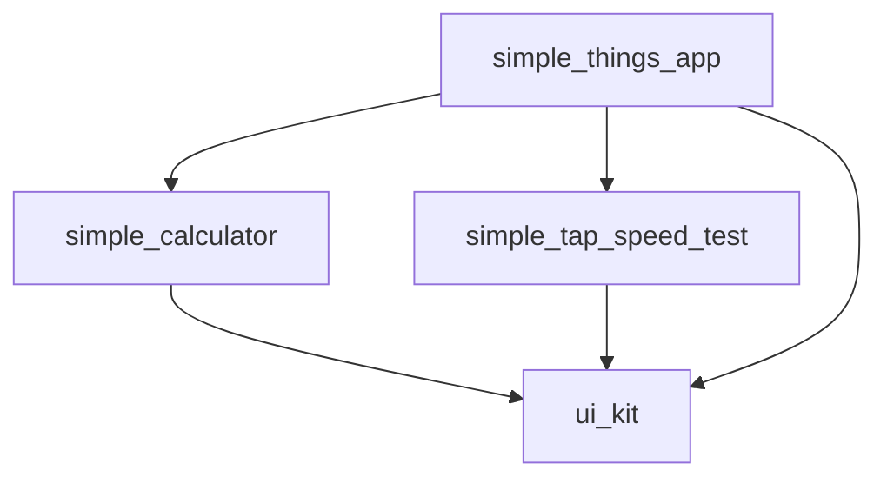

# Flutter Monorepo: Melos + Nx

## English

### Project Description
This repository is a Flutter monorepo where Melos is the primary workspace and release tool, while Nx is used for project graphing and affected-task execution in CI.  
It demonstrates a clean modular architecture with reusable UI components, feature-based packages, and automated CI/versioning flows on the same codebase.

### Architecture Goals
- Clean modular structure
- Feature-based package separation
- Reusable UI kit
- Automatic versioning with Melos
- Affected execution with Nx
- GitHub Actions CI
- Automatic changelog generation
- Dev and Master branch release flow

### Architecture Overview
- `packages/ui_kit`: shared UI primitives and design constants.
- `packages/simple_calculator`: calculator feature package (screen, input widget, logic).
- `packages/simple_tap_speed_test`: tap speed mini-game feature package.
- `apps/simple_things_app`: runnable application that composes feature packages.
- Dependency direction is one-way:
  - `simple_calculator -> ui_kit`
  - `simple_tap_speed_test -> ui_kit`
  - `simple_things_app -> simple_calculator + ui_kit`
  - `simple_things_app -> simple_tap_speed_test + ui_kit`

### Folder Structure
```text
.
├── .github/
│   └── workflows/
│       ├── pr_check.yml
│       ├── dev_version.yml
│       └── release_version.yml
├── apps/
│   └── simple_things_app/
├── packages/
│   ├── ui_kit/
│   ├── simple_calculator/
│   └── simple_tap_speed_test/
├── CHANGELOG.md
├── nx.json
├── package-lock.json
├── package.json
├── pubspec.yaml
└── README.md
```

### Melos Graph
Generate dependency graph:

```bash
fvm dart run melos list --graph
```

Current package dependency graph:


```mermaid
graph TD
  ui_kit["ui_kit"]
  simple_calculator["simple_calculator"]
  simple_tap_speed_test["simple_tap_speed_test"]
  simple_things_app["simple_things_app"]

  simple_calculator --> ui_kit
  simple_tap_speed_test --> ui_kit
  simple_things_app --> simple_calculator
  simple_things_app --> simple_tap_speed_test
  simple_things_app --> ui_kit
```

### Nx Graph
Generate Nx project graph:

```bash
npx nx graph
```

### Local Tooling
For local Nx usage you need Node.js 20+ in addition to Flutter/FVM.

### Bootstrap Project
```bash
npm install
fvm use
fvm flutter pub get
fvm dart run melos bs
```

### Run the App
```bash
cd apps/simple_things_app
fvm flutter run
```

### Melos and Nx Side by Side
Both tools work on the same repository, but they solve different problems.

| Concern | Melos | Nx |
| --- | --- | --- |
| Flutter/Dart workspace bootstrap | Primary tool | Not used as source of truth |
| Versioning and changelog | Primary tool | Not used |
| Release flow (`develop` / `master`) | Primary tool | Not used |
| Affected project detection in CI | Possible, but not used in the current setup | Primary flow via `nx affected` |
| Task graph and cache model | Minimal | Stronger orchestration layer |
| Project graph UI | Limited | Strong built-in graph tooling |

### Versioning with Melos
Melos versioning is based on Conventional Commits and updates changelog automatically.

- Dev pre-release flow:
```bash
fvm dart run melos version -p --preid dev --yes
```
- Master release graduation:
```bash
fvm dart run melos version -g --yes
```

Generated artifacts:
- root workspace changelog (`CHANGELOG.md`)
- package versions and tags
- package changelog updates (when applicable)

### Release Flow (develop -> master)
1. Create feature branch from `develop` (`feature/<name>`).
2. Open PR into `develop` and pass checks.
3. After merge to `develop`, CI creates pre-release versions (`-dev`).
4. After collecting changes, merge `develop` into `master` (often squash merge).
5. Push to `master` runs graduate versioning (`-g`) and creates stable tags.

### GitHub Actions CI
- `pr_check.yml` (on `pull_request`):
  - Nx-based affected checks using `nx affected -t format,analyze,test`
- `dev_version.yml` (on push to `develop`):
  - `verify` job via `nx run-many -t format,analyze,test --all`
  - `version` job (pre-release versioning + tags)
- `release_version.yml` (on push to `master`):
  - `verify` job via `nx run-many -t format,analyze,test --all`
  - `version` job (graduate release + tags)

CI notes:
- `npm ci` is used in GitHub Actions for reproducible Node dependency installation.
- `npm install` remains the local setup command.

### Conventional Commit Examples
```text
feat(calculator): add percent and sign toggle keys
fix(calculator): handle pending minus token
chore: split verify and version jobs
docs(readme): readme updated
```

---

## Русский

### Описание проекта
Это Flutter monorepo, где Melos используется как основной инструмент для workspace и релизов, а Nx отвечает за граф проектов и affected-исполнение задач в CI.  
Проект демонстрирует чистую модульную архитектуру, переиспользуемый UI kit и автоматизированные процессы CI/версионирования на одной и той же кодовой базе.

### Цели архитектуры
- Чистая модульная структура
- Разделение по feature-пакетам
- Переиспользуемый UI kit
- Автоматическое версионирование через Melos
- Affected execution через Nx
- CI на GitHub Actions
- Автоматическая генерация changelog
- Релизный flow через ветки Dev и Master

### Обзор архитектуры
- `packages/ui_kit`: общие UI-компоненты и дизайн-константы.
- `packages/simple_calculator`: feature-пакет калькулятора (экран, клавиатура, логика).
- `packages/simple_tap_speed_test`: feature-пакет теста скорости нажатий.
- `apps/simple_things_app`: запускаемое приложение, собирающее фичи.
- Зависимости направлены в одну сторону:
  - `simple_calculator -> ui_kit`
  - `simple_tap_speed_test -> ui_kit`
  - `simple_things_app -> simple_calculator + ui_kit`
  - `simple_things_app -> simple_tap_speed_test + ui_kit`

### Структура проекта
```text
.
├── .github/
│   └── workflows/
│       ├── pr_check.yml
│       ├── dev_version.yml
│       └── release_version.yml
├── apps/
│   └── simple_things_app/
├── packages/
│   ├── ui_kit/
│   ├── simple_calculator/
│   └── simple_tap_speed_test/
├── CHANGELOG.md
├── nx.json
├── package-lock.json
├── package.json
├── pubspec.yaml
└── README.md
```

### Melos Graph
Сгенерировать граф зависимостей:

```bash
fvm dart run melos list --graph
```

Текущий граф зависимостей пакетов:


```mermaid
graph TD
  ui_kit["ui_kit"]
  simple_calculator["simple_calculator"]
  simple_tap_speed_test["simple_tap_speed_test"]
  simple_things_app["simple_things_app"]

  simple_calculator --> ui_kit
  simple_tap_speed_test --> ui_kit
  simple_things_app --> simple_calculator
  simple_things_app --> simple_tap_speed_test
  simple_things_app --> ui_kit
```

### Nx Graph
Сгенерировать граф проектов Nx:

```bash
npx nx graph
```

### Локальные инструменты
Для локальной работы с Nx нужен Node.js 20+ помимо Flutter/FVM.

### Bootstrap проекта
```bash
npm install
fvm use
fvm flutter pub get
fvm dart run melos bs
```

### Запуск приложения
```bash
cd apps/simple_things_app
fvm flutter run
```

### Melos и Nx в одной кодовой базе
Оба инструмента работают на одном репозитории, но решают разные задачи.

| Задача | Melos | Nx |
| --- | --- | --- |
| Bootstrap Flutter/Dart workspace | Основной инструмент | Не является source of truth |
| Версионирование и changelog | Основной инструмент | Не используется |
| Release flow (`develop` / `master`) | Основной инструмент | Не используется |
| Affected-проверки в CI | Возможны, но не используются в текущей схеме | Основной сценарий через `nx affected` |
| Task graph и cache model | Минимальные | Более сильный orchestration layer |
| UI для графа проектов | Ограничено | Сильный встроенный graph tooling |

### Как работает версионирование
Melos использует Conventional Commits и автоматически обновляет changelog.

- Dev pre-release:
```bash
fvm dart run melos version -p --preid dev --yes
```
- Master graduate release:
```bash
fvm dart run melos version -g --yes
```

Что обновляется:
- workspace changelog в корне (`CHANGELOG.md`)
- версии пакетов и теги
- changelog пакетов (где применимо)

### Release flow (develop -> master)
1. Создание feature-ветки от `develop` (`feature/<name>`).
2. PR в `develop` с прохождением проверок.
3. После merge в `develop` CI делает prerelease версии (`-dev`).
4. После набора изменений `develop` вливается в `master` (часто squash merge).
5. Push в `master` запускает graduate (`-g`) и создает стабильные теги.

### CI в GitHub Actions
- `pr_check.yml` (событие `pull_request`):
  - Nx-based affected checks через `nx affected -t format,analyze,test`
- `dev_version.yml` (push в `develop`):
  - job `verify` через `nx run-many -t format,analyze,test --all`
  - job `version` (prerelease versioning + теги)
- `release_version.yml` (push в `master`):
  - job `verify` через `nx run-many -t format,analyze,test --all`
  - job `version` (graduate release + теги)

Примечания по CI:
- В GitHub Actions используется `npm ci` для воспроизводимой установки Node-зависимостей.
- Для локальной настройки по-прежнему используется `npm install`.

### Примеры Conventional Commits
```text
feat(calculator): add percent and sign toggle keys
fix(calculator): handle pending minus token
chore: split verify and version jobs
docs(readme): readme updated
```
